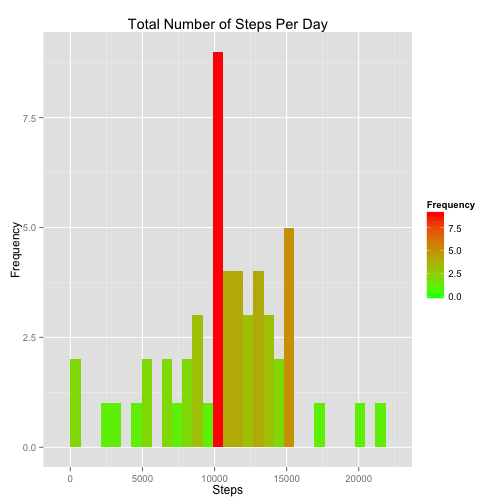
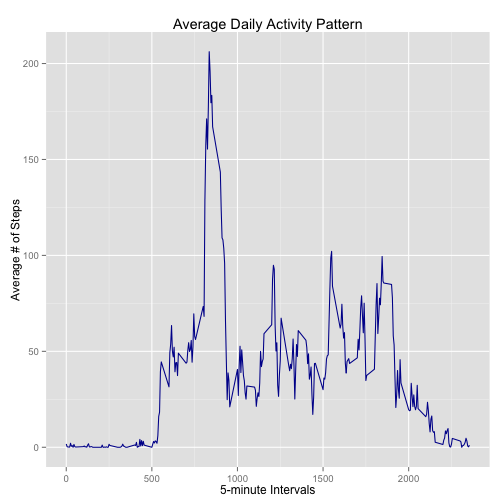
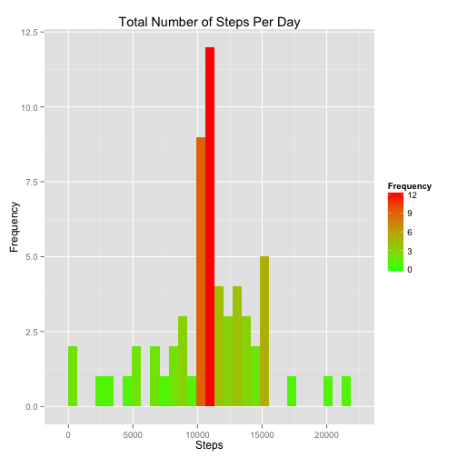
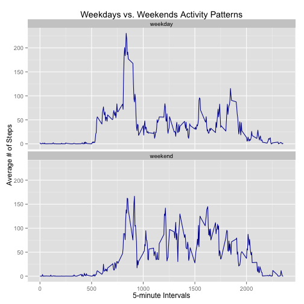

## Introduction
The following analysis is presented as part of the JHU Reproducible Research 
course, Peer Assessment 1.  The source data represents personal movement 
activity observations of a single individual, collected in 5-minute intervals 
daily.  The time period for the data collection spans October 2012 through 
November 2012.

## Load the libraries that this analysis is dependent on

```r
library(knitr)
library(ggplot2)
library(dplyr)
```


## Setup the global options

```r
opts_chunk$set(echo = TRUE)
```


## Loading and preprocessing the data

```r
unzip(zipfile="./activity.zip")
activity.data <- read.csv("./activity.csv")
activity.data <- transform(activity.data, date = as.Date(date))
```


## What is mean total number of steps taken per day?
Group the observations by date.

```r
activity.date.grp <- group_by(activity.data, date)
```

Exclude missing (NA) step values

```r
activity.date.fltr <- filter(activity.date.grp, !is.na(steps))
```

Summarize the steps to calculate the total number of steps taken per day.

```r
activity.date.steps.sum <- summarise(activity.date.fltr, steps = sum(steps))
```

Plot a histogram of the total number of steps taken each day

```r
m <- ggplot(activity.date.steps.sum, aes(x=steps))
m + geom_histogram(aes(fill = ..count..)) + 
    scale_fill_gradient("Frequency", low = "green", high = "red") + 
    labs(title="Total Number of Steps Per Day") + labs(x="Steps", y="Frequency")
```

 

Calculate and report the mean and median of the total number of steps taken per 
day.

```r
mean(activity.date.steps.sum$steps)
```

```
## [1] 10766.19
```

```r
median(activity.date.steps.sum$steps)
```

```
## [1] 10765
```

## What is the average daily activity pattern?

Group the observations by interval.

```r
activity.interval.grp <- group_by(activity.data, interval)
```

Exclude missing (NA) step values

```r
activity.int.fltr <- filter(activity.interval.grp, !is.na(steps))
```

Summarize the steps to calculate average number of steps taken, averaged across 
all days.

```r
activity.int.steps.mean <- summarise(activity.int.fltr, steps = mean(steps))
```

Make a time series plot (i.e. type = "l") of the 5-minute interval (x-axis) and 
the average number of steps taken, averaged across all days (y-axis)


```r
m <- ggplot(activity.int.steps.mean, aes(interval, y=steps))
m + geom_line(colour="#000099") + 
    labs(title="Average Daily Activity Pattern") + 
    labs(x="5-minute Intervals", y="Average # of Steps")
```

 

Which 5-minute interval, on average across all the days in the dataset, contains 
the maximum number of steps?

```r
index <- which.max(activity.int.steps.mean$steps)
activity.int.steps.mean$interval[index]
```

```
## [1] 835
```

## Imputing missing values
Calculate and report the total number of missing values in the dataset

```r
sum(is.na(activity.data$steps))
```

```
## [1] 2304
```

The strategy for filling in all of the missing values in the dataset is to use 
the mean for a given 5-minute interval.

```r
activity.imputed <- activity.data

for (i in 1:nrow(activity.imputed)) {
    
    if (is.na(activity.imputed$steps[i])) {
        activity.imputed$steps[i] <- activity.int.steps.mean$steps[
            which(
                activity.imputed $interval[i] == activity.int.steps.mean$interval
            )
        ]
    }
}
```

Group the observations by date

```r
activity.impute.date.grp <- group_by(activity.imputed, date)
```

Summarize the steps to calculate the total number of steps taken per day.

```r
activity.impute.steps.sum <- summarise(
    activity.impute.date.grp, steps = sum(steps))
```

Plot a histogram of the total number of steps taken each day

```r
m <- ggplot(activity.impute.steps.sum, aes(x=steps))
m + geom_histogram(aes(fill = ..count..)) + 
    scale_fill_gradient("Frequency", low = "green", high = "red") + 
    labs(title="Total Number of Steps Per Day") + labs(x="Steps", y="Frequency")
```

 

Calculate and report the mean and median of the total number of steps taken per 
day.

```r
mean(activity.impute.steps.sum$steps)
```

```
## [1] 10766.19
```

```r
median(activity.impute.steps.sum$steps)
```

```
## [1] 10766.19
```

By imputing the mean for a given 5-minute interval, the median of the total 
number of steps taken per day slightly increased.  The mean of the total number 
of steps taken per day remained unchanged.

## Are there differences in activity patterns between weekdays and weekends?

Using the previous imputed dataset with the filled-in missing values, create a 
new factor variable in the dataset with two levels – “weekday” and “weekend” 
indicating whether a given date is a weekday or weekend day


```r
activity.imputed <- activity.imputed %>% 
    mutate(day_type = factor(ifelse(
        weekdays(date) %in% c("Saturday", "Sunday"),"weekend", "weekday")))
```

Group the observations by interval and day_type (weekend/weekday).

```r
activity.dtype.grp <- group_by(activity.imputed, interval, day_type)
```

Summarize the steps to calculate the average number of steps taken, averaged 
across weekend/weekday.

```r
activity.dtype.steps.mean <- summarise(activity.dtype.grp, steps = mean(steps))
```

Make a panel plot containing a time series plot (i.e. type = "l") of the 
5-minute interval (x-axis) and the average number of steps taken, averaged 
across all weekday days or weekend days (y-axis)


```r
m <- ggplot(activity.dtype.steps.mean, aes(interval, y=steps))
m + geom_line(colour="#000099") + 
    labs(title="Weekdays vs. Weekends Activity Patterns") + 
    labs(x="5-minute Intervals", y="Average # of Steps") + 
    facet_wrap(~day_type, ncol=1)
```

 


